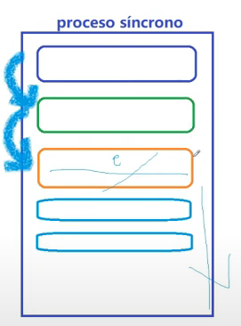
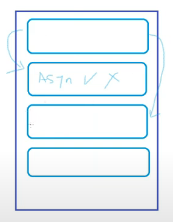

# ClaseComplementaria

## Descripccion
propuesta para practica de los temas 
*Bootstrap
*Node.js
*Express
*Mongo DB
*Logica de programacion 

## Autor 

*Nataly Reyes

## para la parte de Node 

Crear una carpeta llamada public y pasar mis archivos de index, css, y asests

## Node Js y express
1. Node Js 
2. Modelo cliente servidor  
3. protocolo http
4. npm / dependencias 
5. express-nodemon 
6. es6 y commonjs

## Node js
Que es?
mas que una herramienta o una extencion node js es un entorno de ejecucion permite a la maquina entender el codigo de JS y mostrar una respuesta

por que es importante node

es importante por que es el unico entorno que nos permite ejecutar Js en un servidor o navegador y tambien lo podemos ejecutar desde nuestra consola

se descarga en este link
 ## https://nodejs.org/en/download

promesas: son cosas que tu no sabes cuando se van a ejecutar pero que ya se hicieron estas solicitudes esperando a tener una respuesta

Orientado a eventos asincronos: Esto significa es que esta trabajando al mismo tiempo con otras solicitudes mientras la promesa se cumple

proceso sincrono

proceso asincronico

## Modelo cliente servidor

Es un envio de informacion que hace el cliente esparando una respuesta de un servidor el cliente es lo que nosotros vemos como usuario y el servidor es quien nos da la respuesta ejemplo elcliente ve la suma de los numeros es 8. Lo que ve el servidor es: 
suma = 5+3 ; 
mostrar la suma de los numeros es suma;
todo esto se hace mediante el protocolo HTTP 

## NPM Y DEPENDENCIAS

Dependencias es un paquete o un codigo que es necesario para que funcione otro 

## como empezar
1. ir a la terminal usar el codigo npm init 
2. seguimos los pasos de la siguiente forma 
*package name: (clasecomplementaria)
version: (1.0.0)
description: e-comerce para repso de conceptos
entry point: (index.js)
test command:
git repository:
keywords:
author: Nataly Reyes 
license: (ISC)
About to write to C:\Users\lenar\Desktop\claseComplementaria\package.json:

{
  "name": "clasecomplementaria",
  "version": "1.0.0",
  "description": "e-comerce para repso de conceptos",
  "main": "index.js",
  "scripts": {
    "test": "echo \"Error: no test specified\" && exit 1"
  },
  "author": "Nataly Reyes",
  "license": "ISC"
}

Is this OK? (yes) seleccionamos Y para continua y nos crea un paquete.json que trae la informacion aterior
3. otra forma de hacerlo mas rapido es ingresando npm init --yes  o -y da igual cualquier forma y nos crea el mismo paquete.json donde se puede ingresar y modificar los datos 
4. ahora se instalan las dependencias para que nuestro proyecto funcione se descargan dependencia por dependiendo la necesidad
 a. npm i express
 b. npm i nodemon

 al instalarse los otros 95 paquetes es lo que llamamos dependencias por que son paquetes necesarios para que express o nodemon funcionen bien 

